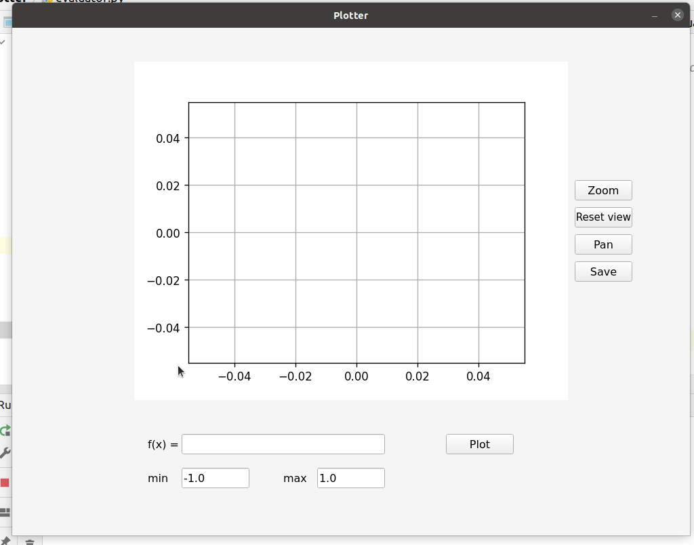

# Plotter

A simple QT-based single-variable function plotter. This is a part of the MasterMicro software engineering intern role task.

## Usage

The Plotter application can be used to plot combinations of polynomials and exponentials. It supports the following operators. `+-*/^`. Parenthesized expressions are supported and operator precedences are defines along the lines of [this](https://en.wikipedia.org/wiki/Order_of_operations) Wikipedia page. The user is free to define the range of the input `x`.

## Internals

The application consists of three main components.

### Parser (expr_parser/parser.py)

Takes a string expression as input, and constructs the [abstract syntax tree](https://en.wikipedia.org/wiki/Abstract_syntax_tree) (AST). The parser expects only one valid expression, so two consecutive expressions are treated as one erroneous expression. The return value of the `Parser.parse()` is an AST object that contains the tree structure of the expression along with any errors that occurred while parsing, and the identifiers in the expression.

### Evaluator (evaluator.py)

Takes in an AST object and recursively evaluates the result of computing the underlying expression. Identifiers must have associated values before attempting to evaluating the AST. This is used in the `evaluate_in_range` function that generates an array of equidistant points for the `x` input and evaluates the AST for each input point.

### GUI (gui.py)

All the QT-related code for initializing the `PlotterWidget`, which is the main window of the application, and embedding the `matplotlib` plot inside the `PlotterWidget` using the `matplotlib` QT backend API. Custom navigation-toolbar-like buttons are instantiated for zooming, `panning, resetting the view, and saving the plot figure to disk.

## Error Handling

Errors are captured in the `Lexer`, the `Parser`, and the `Evaluator` before attempting to draw the plot. Errors are propagated from the lexer to the parser since the parser is the user-facing interface. A user should not attempt to instantiate a `Lexer`. Errors are reported in the GUI window under the input controls.

### Lexer Errors

On the lexer level, only a set of tokens is defined and if any other character is present in the input, it will report an error. Example erroneous expressions include the following.

### Parser Errors

In the parser, logical errors are discovered and handled. For example, if two consecutive _correct_ expressions are input, the parser will err. It only expects one expression as input. An example of erroneous input is: (`1 1`). Those are two separate expressions, any of which is right. However, the input must be considered wrong.

Other logical errors like having only one operand to a binary operator and missing parenthesis are reported by the parser.

Errors are packed into the AST object, the user of the parser can check for those errors, subsequently.

Example erroneous inputs that get discovered by the parser:

### Evaluator Errors

The evaluator must be only called using an AST that contains no errors. Thus, errors reported by the lexer and the parser must be handled before calling `Evaluator.eval()`. The errors reported by the evaluator include having no value to an identifier. The expression `x + y` is evaluable correctly _if and only if_ the evaluator is aware of the values of `x` and `y` before evaluation time. If such an expression is passed to the evaluator without the values of one or more of the identifiers, it will raise an error.

